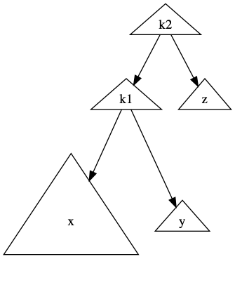

# Avl Tree

对于二叉搜索树，如果预先输入一堆排好序的序列，其会退化成单链表。为了解决这个问题，规定一个平衡的附加条件:任何节点的深度都不的过深。但是标准的二叉平衡树实现起来复杂性过高，因此介绍一种较为经典的平衡术---avl(adelson-velskii and landis) 树

它的特点是:

1. 每个节点的左子树和右子树相差高度不超过1的二叉搜索树


## Insert 

对于 avl 树最主要的问题应该在于插入后，如何保证其平衡的要求即: `每个节点的左子树和右子树相差高度不超过1`

对于一节待平衡节点，破坏其平衡由四种可能

1. 对其左儿子的左子树一次插入
2. 对其左儿子的右子树一次插入
3. 对其右儿子的右子树一次插入
4. 对其右儿子的左子树一次插入

对于每一种情况进行分析

### left - left 结构(即第一种)




此时 `k2` 节点是不平衡的，

此时以`k1`为节点，顺时针旋转,`k2`，然后将`k1`的右孩子置为`k2`，`k2`的左孩子置为`y`


```c
Position single_rotate_with_left(Position k2)
{
    Position k1;
    k1 = k2->left;
    k2->left = k1->right;
    k1->right = k2;

    k2->height = max(height(k2->left), height(k2->right)) + 1;
    k1->height = max(height(k1->left), height(k1->right)) + 1;
    return k1;
}


```


### right - right 结构(第三种)


此时与第一种对称

```
Position single_retate_with_right(Position k1)
{
    Position k2;
    k2 = k1->right;
    k1->right = k2->left;
    k2->left = k1;

    k2->height = max(height(k2->left), height(k2->right)) + 1;
    k1->height = max(height(k1->left), height(k1->right)) + 1;
    return k2;
}

```

### left-right 结构[第二种结构]


此时可以观察，`k1`,`k2`,`k3`布局，使用两次旋转。第一次对于`k1,k2`进行一次右单旋(第三种结构)。再对调整后的布局(`k2`,`k3`)再进行一次左单旋。


```c

Position rotate_with_right_left(Position k3)
{
    k3->left = single_rotate_with_right(k3->left);
    return single_rotate_with_left(k3);
}

```


### right-left 结构[第四种结构]


此时可以观察，`k1`,`k2`,`k3`布局，使用两次旋转。第一次对于`k2,k3`进行一次左单旋(第一种结构)。再对调整后的布局(`k1`,`k2`)再进行一次右单旋。

```c
Position rotate_with_left_right(Position k1)
{
    k1->right = single_rotate_with_left(k1->right);
    return single_rotate_with_right(k1);
}

```

### 插入

接下来的插入就比较清晰了，插入流程与二叉搜索树一样，但是每次插入之后，要对其平衡性进行判断，根据不同的情形，进行不同的调整:

```c

AvlTree insert(Element e, AvlTree t, compare_func cmp)
{
    if (t == NULL)
    {
        t = (AvlTree)malloc(sizeof(struct AvlNode));
        t->height = 0;
        t->e = e;
        return t;
    }
    int cp = cmp(e, t->e);
    if (cp == 0)
        return t;
    else if (cp > 0)
    {
        t->right = insert(e, t->right, cmp);
        if (height(t->right) - height(t->left) == 2)
        {
            if (cmp(e, t->right->e) > 0)
            {
                t = single_rotate_with_right(t);
            }
            else
            {
                t = rotate_with_right_left(t);
            }
        }
    }
    else
    {
        t->left = insert(e, t->left, cmp);
        if (height(t->left) - height(t->right) == 2)
        {
            if (cmp(e, t->left->e) < 0)
            {
                t = single_rotate_with_left(t);
            }
            else
            {
                t = rotate_with_left_right(t);
            }
        }
    }

    t->height = max(height(t->left), height(t->right)) + 1;
    return t;
}

```

## find 

查找过程与二叉搜索树一样

## delete 
删除采用哑节点的模式，因为删除后的调整更为繁杂。

```c
AvlTree remove(Element e, AvlTree t, compare_func cmp)
{
    Position p = find(e, t, cmp);
    if (p == NULL)
    {
        return NULL;
    }
    p->rate = 0;
    return p;
}

```

## Implement

[avl_tree](../src/avl_tree.c)
