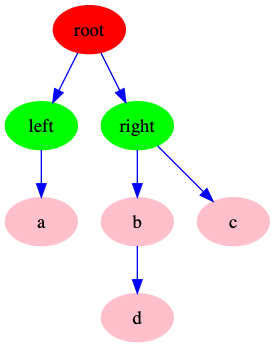
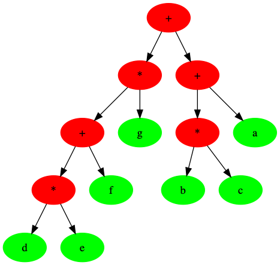

# Binary Tree
二叉树是一种特别的树，它的子节点不超过两个。
它有几个特别的性质:
1. 子节点不超过两个
2. 它的平均深度其平均值为`O(N^(1/2))`
3. 它可以退化成链表，此时，深度最大为`N-1`

示意图如下:




## 实现
由于它的子节点最多两个，所以它的单个节点的链表表示方法，可以采用两个指针，分别指向该节点左右子节点。

类似与下面的结构:

```c

typedef struct binary_tree_node
{
    Element element;
    struct binary_tree_node *left;  // left child node
    struct binary_tree_node *right;  // right child node

} BinaryTreeNode;

```

树的结构类似于下面:

```c
typedef struct binary_tree
{
    BinaryTreeNode *root;
    int size;
} BinaryTree;

```

因为普通的二叉树与普通的`tree`，类似应用不多，重点是一些特别二叉树

1. [search_tree](./search_tree.md)
2. [avl_tree](./avl_tree.md)
3. ...

它们与二叉树拥有基本相同的数据结构，但是有一些特性，是它们的应用更加广泛。


## 二叉树的遍历

由于二叉树的特殊结构，因此它的遍历方式相对于[普通树的遍历](./tree.md#树的遍历)，稍微有所不同。

下面以一个特别的例子，`表达式树`(expression tree)来说明它的遍历过程

### 表达式树
表达式树的树叶(leaf)是操作数(operand)，即常量或者变量,其它节点是操作运算符(operator)。因此，它的构造刚好是一个二叉树🌲。

假设一个表达式如下:
```
// (left) + (right)
(((d*e)+f)*g)+((b*c)+a)
```
它的树形结构为:




#### 中序遍历
我们通过递归产生一个带括号的左子树，然后是左子树根处的运算符，最后再递归的产生一个带括号的右子树。这一种方式是`左，节点，右`。
其结果应该为
```
d * e + f * g + b * c + a
```

从结果来看，其最易读。

实现

```c
void *binary_tree_inorder(BinaryTreeNode *node)
{
    if (node)
    {
        binary_tree_preorder(node->left);
        printf("%p", node->element);
        binary_tree_preorder(node->right);
    }
}

```

#### 先序遍历
与普通树一样，这一种方式是`节点，左，右`。
其结果应该为
```
+ * + * d e f g + * b c a
```

一团乱麻～～～

```c

void *binary_tree_preorder(BinaryTreeNode *node)
{
    if (node)
    {
        printf("%p", node->element);
        binary_tree_preorder(node->left);
        binary_tree_preorder(node->right);
    }
}

```
#### 后序遍历
与普通树一样，这一种方式是`左，右，节点`。

其结果应该为
```
d e * f + g * b c * a + +
```
后缀表达式

```c
void *binary_tree_postorder(BinaryTreeNode *node)
{
    if (node)
    {
        binary_tree_preorder(node->left);
        binary_tree_preorder(node->right);
        printf("%p", node->element);
    }
}

```

## 二叉树的应用

关于二叉树有一些相关的应用(刷题时间)


