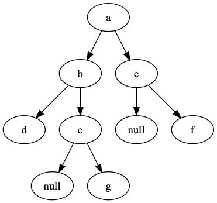

# Binary Tree Algorithm


## [leetcode-94 Binary Tree Inorder Traversal](https://leetcode.com/problems/binary-tree-inorder-traversal/)

非递归中序遍历


### 思路

```c++

/**
 * Definition for a binary tree node.
 * struct TreeNode {
 *     int val;
 *     TreeNode *left;
 *     TreeNode *right;
 *     TreeNode(int x) : val(x), left(NULL), right(NULL) {}
 * };
 */
class Solution {
public:
    vector<int> inorderTraversal(TreeNode* root) {
        stack<TreeNode *> s;
        vector<int> data;
        TreeNode *p = root;
        while (p || !s.empty())
        {
            while (p)
            {
                s.push(p);
                p = p->left;
            }
            if (!s.empty())
            {
                p = s.top();
                data.push_back(p->val);
                s.pop();
                p = p->right;
            }
        }
         return data;
    }
};

```


## 非递归的前序遍历 

```c++
vector<int> preorderTraversal(TreeNode* root) {
        stack<TreeNode *> s;
        vector<int> data;
        TreeNode *p = root;
        while (p || !s.empty())
        {
            while (p)
            {
                s.push(p);
                data.push_back(p->val);
                p = p->left;
            }
            if (!s.empty())
            {
                p = s.top();
                s.pop();
                p = p->right;
            }
        }
         return data;
    }

```

## 非递归的后序遍历

这个稍微麻烦一点,以下图为例来讲解一下，其中null代表节点不存在:




首先它的结果是: 

d->g->e->b->f->c->a

同样我们采用一个堆栈来存储访问路径，遇到一个节点，若其左右子节点存在(即，有一个存在即可)，则将其左右子节点按照`右、左`的顺序放入堆栈中。注意此时，该节点并没有被删除，也就是说，存在一个节点访问两次的情况。因此，要有一个标识，来区分第几次访问。只有第二次访问到它的时候(还有一种情况)，才需要将其放入数组中。如果说，没有左右节点，将其直接放到数组中，作为返回结果。

代码实现如下:

```c++
  vector<int> postorderTraversal(TreeNode *root)
    {
        map<TreeNode *, int> visits;
        stack<TreeNode *> container;
        vector<int> nodes;
        TreeNode *node = root;
        if (node)
        {
            container.push(node);
        }
        while (!container.empty())
        {

            TreeNode *temp = container.top();
            // if has visited
            if (visits.count(temp) > 0 )
            {
                nodes.push_back(temp->val);
                container.pop();
            }
            else
            {
                if (temp->left || temp->right)
                {
                    if (temp->right)
                    {
                        container.push(temp->right);
                    }
                    if (temp->left)
                    {
                        container.push(temp->left);
                    }
                    visits[temp] = 1;
                }
                else
                {
                    nodes.push_back(temp->val);
                    container.pop();
                }
            }
        }
        return nodes;
    }

```
## 判断两个树是否相等

```
Example 1:

Input:     1         1
          / \       / \
         2   3     2   3

        [1,2,3],   [1,2,3]

Output: true
Example 2:

Input:     1         1
          /           \
         2             2

        [1,2],     [1,null,2]

Output: false

```


