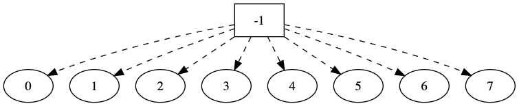

# Disjoint Set

不相交集类,它只有两个基本操作，`Find` 和 `Union`

## 定义

就是一系列简单的集合关系，我觉得看图更加容易理解:


集合 X,Y 构成一个不相交集合(或者称之为一个类 C，其实是一个森林)。

对于这个类 C，它只有两种操作

- Find
- Union

如 Find(a) 返回的是，该元素所在的集合或者等价类

Union(a,b) 如果 a,b 不在同一个集合内，则是两者合并，行如 `X U Y`。


## 数据结构

采用树来表示每一个集合，那么`find`操作也就是返回一个树根，而`union`操作就是将一个集合的根元素的父指针指向另一个集合的根元素。

这里可以采用 数组S 来表示树(二叉树)，数组中的每个元素 S[i] 代表元素 i 的父亲。

如下图



### union(a,b)

union 操作将 a,b 所在的集合合并

```union(4,5),union(6,7),union(5,7)```过程如下:

.png)

.png)

.png)


### find(x) 

find(7)

.png)


由于 union 过程中，可能出现建立一个深度为 N-1 的树(一条路径)，这时的查找时间复杂度就变成了 O(N) 

## Implements

