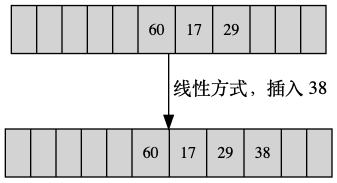
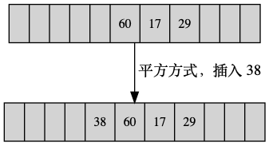
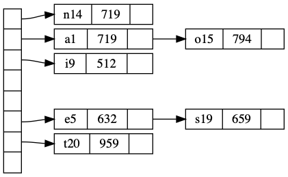

# hash table

哈希表，或者散列，字典

- 支持 `O(1)` 时间复杂度下进行访问，删除，增加，修改的数据结构。
- 无序的
- 两个部分组成，`key` 和 `value` 

它的基本思想是，将每个关键字(通过散列函数)映射到一个固定大小的数组(`O(1)`)中。但是，容积是有限的，因此可能存在一个情况，即: 两个关键字散列到了同一个位置，也就是哈希冲突。

因此对于哈希表的关键就是，`散列函数`以及`哈希冲突的处理`

## 散列函数

它的作用是，通过某种运算，将输入的键值(key)转化为数组的索引值。

比较常见的散列函数有:

- 除法散列函数
- 乘法散列函数


### 除法散列函数

最最最常见的应该就是 `mod` 了，使用 mod ，通常将表的大小设置为素数，这样可以减少一些不必要的冲突。

```key mode tableSize```

但是，key 并不都是整数，它可能是一个字符串，或者是一个指针。取它的内存地址是一个不错的方案，另外一些是是对它进行一些函数转换。

其实通常来说，key 是字符串，因此对于字符串的一个处理方式是，所有的 ascii 码相加，然后再进行 mod。但是，对于长度最多为8的字符串，它的ascii 码范围为 0-127.因此最大值为127*8=1016，即key取值再 0--1016 之间。假设，表的大小为 10007，这样明显不是一个均匀的分配方式。

下面是java string 的`hashCode` 的实现方式

```java
  public int hashCode() {
        int h = hash;
        if (h == 0 && value.length > 0) {
            char val[] = value;

            for (int i = 0; i < value.length; i++) {
                h = 31 * h + val[i];
            }
            hash = h;
        }
        return h;
    }

```

哈希函数的取值多种多样，重在灵活的应用。通常，考虑的因素有:

1. 哈希函数的计算时间
2. 关键字的长度
3. 哈希表的大小
4. 关键字的分布情况
5. 记录的查找频率

## 哈希冲突

假设 `key1,key2`为两个键值，`f(x)` 为哈希函数。当 `key1!=key2`时，`f(key1)=f(key2)`，这种现象就是哈希冲突。哈希冲突是无法避免的，因此如何处理哈希冲突也是影响哈希表的一个重要因素。

一般常用的处理方法有:

- 开放地址法
- 链地址法
- 再哈希法

### 开放定址法

```
H_i = （H(key)+d_i）mod m, i = 1,2,3,4,5...k,(k<=m-1)

```

定义为 `H(key)` 为散列函数，`m` 是表长. 

- 当 ```d_i = 1,2,3,4...m-1``` 时，线性再散列
- 当 ```d_i = i^2,-1^2,2^2,-2^2,...k^2,-k^2``` 时，平方再散列
- 当 `d_i` 为伪随机数时，伪随机再散列

一个例字，假设表长 11(`m=11`),哈希函数为 `key mod m`, 表内已包含元素 `60,17,29`。 再插入 38 时，计算得索引为 5,与 60 冲突

采用线性再散列，即向后遍历直到有空闲的位置，此处是位置 8




如果采用平方再散列，则应该 4 



如果采用随机数的方式，就是随机给出一个索引，然后判断是否仍旧冲突，冲突的话，继续产生随机，直到可以插入为止。

### 链地址法

也成拉链法等，它对哈希冲突的处理策略是，将产生冲突的元素放入到一个链表)(一般为双向链表)中，链表插入，通常选择再链头插入

它的示意图如下:




当然，由于 数组的大小不能够无限大，因此当存储的元素足够多时，链表中的元素也会很多，这个时候查询的效率便会严重下降。因此，为了提高查询效率，有些时候将链表替换为一个平衡搜索树(如 JDK-8 之后就是**红黑树**)，这样子虽说插入的效率有所降低，但是查询的效率大大提高。


### 再哈希法

顾名思义，就是当哈希函数导致冲突之后，再使用一个哈希函数就是地址，直到没有哈希冲突为止。


**一般工程之中常用的就是链地址法**


### 装填因子

除了以上的一些冲突处理策略之外，还有一个概念，装填因子(`loader factor`)，它的含义是: a= 表中已有的记录数/表的长度。

这里涉及到再散列的问题，通常为了防止冲突过多导致的插入、查询效率，采用扩容的方式，这个过程就是再哈希。而再哈希的判断标准，通常采用装填因子(a)，来决定。 如 JDK 内，当 a 到达 0.75 时，就会进行再散列(直到达到最大表长)。

## Implement

[HashTable](../src/hash_table.c)

