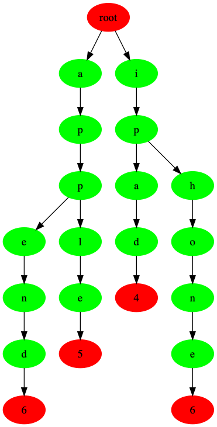

# Prefix Tree (Trie)

`trie` 又称为前缀树或者字典树，是一种有序树，用于保存关联数组,它属于一种有限自动机(DFA)。它的键一般是字符串,使用它可以字符串的搜索复杂度，降到 `O(m)`，m 是字符串的长度，是一种典型的以空间换时间的方式。它的最大深度是，字母表的深度(一般)

它的典型应用，用于`联想搜索`,`NLP`等


## 结构

已字符串为例(不区分大小写)
``` 
“apple”、“ipad”、“iphone”、“append””
``` 

它形成的一个字典树的结构如下




观察可以看出

- 拥有相同前缀的词，在一条串内。如 `apple` 和 `append`。而 `ipad` 与 `apple` 虽然都含有 字符 `a`，但是并没有相同的前缀，因此分布在不同串内(即只使用公共前缀，不使用词的其它部分)。
- 一个完整的词存储，是从根节点一直到页节点为止，因此查询一个词，必须从根节点到叶节点为止。
  

### 时间复杂度

它的搜索以及插入过程，均是一条链表出发，向下搜索，操作只在一条串内逐字比较，直到叶子节点

- 所有搜索比较均在一条串内，因此大大缩小了比较的范围。
- trie 是一个状态机，因此逐字搜索时，无需遍历所有子节点

时间复杂度 为 O(m),m 为字符串的长度。


### 实现

- 一个简单的实现是采用链表+hash 表来实现
  ```c
  struct trie_node {
       Element val; // 
       HashTable nodes; 
       boolean isLeaf; // is leaf or not
       };
    ```

- 也可以使用一个 数组来实现
  ```c
  struct trie_node {
       Element val; // 
       struct trie_node **nodes;
       boolean isLeaf; // is leaf or not
       };
   ```
   nodes 是固定长度的一个数组，比如如果是数字，它可以设置为 10 ，字母设置为 26

- 链表实现
  上面使用数组实现，可能会造成空间的浪费，所以采用链表来实现
   ```c
  struct trie_node {
       Element val; // 
       struct trie_node *node;
       boolean isLeaf; // is leaf or not
       };
   ```
   但是，使用链表，去查询是要遍历所以子节点去匹配，降低了查询效率。


- 主流的操作是使用 `Double-array Trie`
  本文也采用此方法。

#### Double-array Trie


## Related

- [ hash table ](./hash_table.md)


## Application

- [ trie_database ](https://github.com/hsjfans/trie_database)
- [ trie_leetcode ](https://github.com/hsjfans/leetcode/src/trie) 
- [ easy log ](https://github.com/hsjfans/easy_log) 一个分布式日志存储以及搜索框架


## Reference

- [ DFA - deterministic finite automaton ](./dfa.md)
- [ database system ](https://dbis.uibk.ac.at/sites/default/files/2018-06/hot-height-optimized.pdf)
- [ database system ](https://db.in.tum.de/~leis/papers/ART.pdf) 
- [trie ](https://www.geeksforgeeks.org/trie-insert-and-search/)
- [trie](https://segmentfault.com/a/1190000008877595?utm_source=tag-newest)
