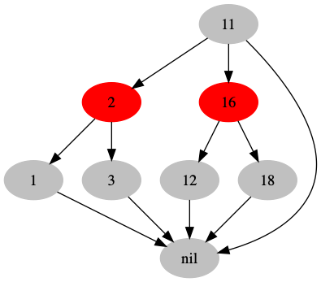

# 红黑树

上面介绍了二叉搜索树以及avl树，这里介绍另外一种近似平衡的二叉树-- 红黑树
它的每个节点都有5个属性: `color、key、left、right、p`

一棵红黑树通常拥有以下性质

1. 每个节点或是红色，或是黑色的 (rb)
2. 根节点是黑色的
3. 每个叶子节点也是黑色的
4. 如果一个节点是红色的，则它的两个子节点都是黑色的
5. 对于每个节点，从该节点到所有后代叶节点的简单路径上，均包含相同数目的黑色节点
   



## 它的插入删除以及访问的时间复杂度为 O(lgN)
定义，**bh(x)** (black height) 为黑高，即节点`x`到期叶子节点的黑色节点的个数
### 证明:

一个n个内部节点的红黑树，它的高度最多为 2lg(n+1) 
首先证明:
一个节点的x的最好含有`2^(bh(x))-1`个节点


由性质5，可以看出:

对于一个任意节点`x`，它的左右节点的黑高为`bh(x)`或者`bh(x)-1`.即它的最少黑高为`bh(x)-1`，则 以x为根的子树，至少含有

```2^(bh(x)-1-1+2^(bh(x)-1)-1+1 = 2^bh(x)-1```

个节点数，

由性质4，可以看出
对于高度为h的红黑树，它的黑高至少为h/2,所以 

```n>=2^(h/2)-1 ```

解之可🉐, ```h<= 2lg(n+1)```

得证

## 调整节点

与avl树，类似，红黑树的插入或者删除，可能破坏其平衡(性质)。因此需要进行旋转调整。

### 平衡的破坏

我们设定每次插入的元素都是红色节点(这样子可以避免最坏情况的发生)，这样子不会破坏性质1、3、5.

对于性质2的破坏，我们很容易进行识别出来。对于性质4的破坏，我们要进行简单分析一下。

对于更新破坏红黑树特性的问题，有一些调整的方法:
- BST operation
- Color changes
- Restructure the tree via rotation (recolor、lint)


### 左旋 and 右旋


这些操作只是进行了指针的交换，话费常数时间。


### Insert element

对于新插入的节点，我们设定它都是红色的，然后采用一些操作，对其平衡性进行调整
主要的调整方法为:

- recolor
- rotation

#### 一个例子

先通过一个实例进行详细描述，后面在进行抽象，下面是一个红黑树插入元素15的过程。


1. 先找到待插入的位置，插入元素15，并将其着色为 红色
2. 15的祖父节点颜色是黑色，而它的父节点以及叔节点颜色是红色，因此，可以将祖父节点颜色下沉，即重新着色祖父节点为红色，叔节点以及父节点为黑色(case-1)。这时，冲突就变成了 10-18 颜色冲突


3. 10-18 颜色冲突，且对于节点10来说，它并满足（case-1）的情况，无法进行重着色来满足条件4.此时，采用旋转操作，以节点10进行右旋（case-2），将10-18以及祖父节点在一条直线(看上去)。


4. 再以节点10为节点，进行左旋(case-3)，然后重新着色（次数左子树黑高降低一，因此需要重新着色）
5. 将跟节点重新着色。

#### 抽象

对于以上可以分为三种状态(或6种，因为左右情况对称,下面已左面情况为例)。
```Insert(x)```,`x` 是插入的节点，`f(x)` 是其父节点，`f(f(x))` 是其祖父节点 `uncle of x as u(x)` 是其叔叔节点（y）。

单线条是黑色节点，双线条是红色


##### case-1  


该情况是，`f(f(x))` 是黑色，`f(x)`是红色，`u(x)`是红色。

此时，可以将其祖父节点(`f(f(x))`)颜色吓成，即变成
```
color[f(x)] = BLACK
color[f(f(x))] = RED
color[u(x)] = BLACK
```
此时，可以解决节点x的颜色冲突。

```c
void re_color(RBTreeNode b)
{
    b->parent->color = RED;
    b->parent->left->color = BLACK;
    b->parent->right->color = BLACK;
    return;
}

```

##### case-2


此时，节点`y`不是红色，无法通过着色来解决。x 是其父节点的右节点，视觉上看，节点`C-A-B`不再一条直线上，此时采用旋转，来使节点`C-A-B`在一条直线上

```

a->right = c
c->left = b
b->parent = c
a->parent= c->parent
c->parent = a

```

```c
void left_rotation(RBTree t, RBTreeNode a)
{
    RBTreeNode b = a->right;
    a->right = b->left;
    if (a->left != NULL)
    {
        b->left->parent = a;
    }
    b->parent = a->parent;
    if (a->parent == NULL)
    {
        t->root = b;
    }
    else if (a == b->parent->left)
    {
        a->parent->left = b;
    }
    else
    {
        a->parent->right = b;
    }

    b->left = a;
    a->parent = b;
}


```


##### case-3


节点`y`不是红色，无法通过着色来解决。x 是其父节点的左节点，视觉上看，节点`C-A-B`在一条直线上。此时，可以采用旋转加重着色进行调整。

```

c->left = a->right
a->right = c
a->parent=c->parent
c->parent=a
c->left=c

color[a] = BLACK
color[c] = RED


```


```c
// right rotation
void right_rotation(RBTree t, RBTreeNode a)
{
    RBTreeNode b = a->parent;
    a->parent = b->parent;
    if (b->parent == NULL)
    {
        t->root = a;
    }
    else if (b->parent->left == b)
    {
        b->parent->left = a;
    }
    else
    {
        b->parent->right = a;
    }
    if (a->right != NULL)
    {
        a->right->parent = b;
    }
    b->left = a->right;
    b->parent = a;
    a->right = b;
}

```


#### complicate

```c

void insert(RBTree t, Element e, compare_func cmp)
{
    RBTreeNode root = t->root;
    RBTreeNode temp = t->nil;
    while (root != t->nil)
    {
        temp = root;
        if (cmp(e, root->val) < 0)
        {
            root = root->left;
        }
        else
        {
            root = root->right;
        }
    }

    RBTreeNode n = make_node(e);
    n->parent = temp;
    if (temp == t->nil)
    {
        t->root = n;
    }
    else if (cmp(e, temp->val) < 0)
    {
        temp->left = n;
    }
    else
    {
        temp->right = n;
    }
    n->left = t->nil;
    n->right = t->nil;
    n->color = RED;
    insert_fix_up(t, n);
    return;
}

void insert_fix_up(RBTree t, RBTreeNode n)
{
    while (n->parent->color == RED)
    {
        // left child subtree
        if (n->parent == n->parent->parent->left)
        {

            RBTreeNode y = n->parent->parent->left;
            // case-1
            if (y->color == RED)
            {
                re_color(n->parent);
                n = n->parent->parent;
            }
            // case 2
            else if (n == n->parent->right)
            {
                n = n->parent;
                left_rotation(t, n);
            }
            // case 3
            else
            {
                n->parent->color = BLACK;
                n->parent->parent->color = RED;
                right_rotation(t, n->parent->parent);
            }
        }
        // right subtree
        else
        {
            RBTreeNode y = n->parent->parent->right;
            // case-1
            if (y->color == RED)
            {
                re_color(n->parent);
                n = n->parent->parent;
            }
            // case 2
            else if (n == n->parent->left)
            {
                n = n->parent;
                right_rotation(t, n);
            }
            // case 3
            else
            {
                n->parent->color = BLACK;
                n->parent->parent->color = RED;
                left_rotation(t, n->parent->parent);
            }
        }
    }

    t->root->color = BLACK;
}
```


## Related

1. [skip_list](./skip_list.md)
2. [avl_tree](./avl_tree.md)
3. [Treap](./treap.md)
