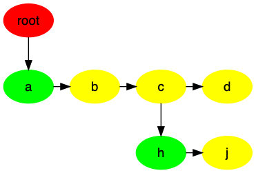
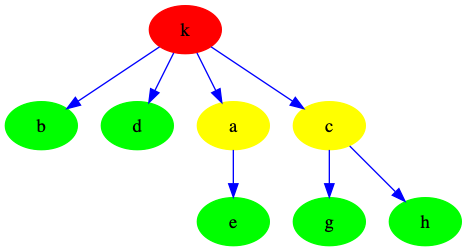
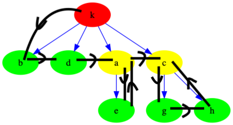
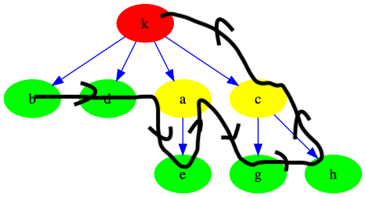
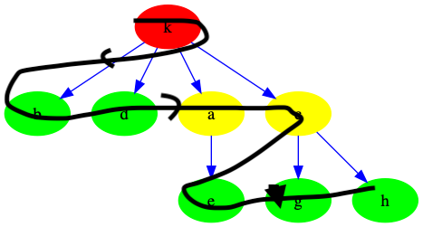

# Tree
对于大量的数据，链表的线性访问时间太长。而树是一种非线性的数据结构，它的大部分操作的平均运行时间是`O(logN)`
树也是很多集合类的基础,如`set`和`map`。

## 定义

树是`n`个节点的有限集。对于每棵树:
1. 都有一个根节点(`root`)
2. 当n>1时，其它节点都有`m`个**不相交的有限集**(这里在后面很有用)，也称为`子树`(`subtree`)
3. 如果一个子树没有子节点，则称之为 `叶子节点`(`leaf`)
4. 具有同一个`父节点`(`parent`)的节点，为`兄弟节点`(`sibling`)
5. 对于任意节点n,它的**深度**为其到跟节点的路径的`边数`

它的结构通常如下


红色为根节点，绿色是叶子节点，蓝色是边，黄色是兄弟节点(未画全)。


## 树的实现

树的实现结构可以有很多种，比较合理的是采用链表的结构，而针对每个节点来说，其只需要知道第一个子节点和下一个兄弟节点即可。

### 单个节点的结构

```c
typedef struct tree_node
{
    Element e; // the value
    struct tree_node *nextSibling;
    struct tree_node *firstChild;

} TreeNode;

```

### 树的结构

对于树，只要根节点的位置，即可拿到其它全部节点的信息
```
typedef struct tree
{
    TreeNode *root;
} Tree;
```

### 整体的结构示意图

因此整体的结构示意图如下:



绿色节点代表第一个子节点(first child), 黄色代表下一个兄弟节点(sibling node)


### 树的遍历

树比较典型的应用是`unix文件系统`，而它的使用核心是对树的遍历。其实从树的定义中可以很清晰的看出，它很符合递归的特点,因此对树的遍历通常是应用递归的方法。

对树的遍历按照先后顺序通常分为以下几种:

1. 先序遍历
2. 后序遍历
3. 层序遍历
4. DFS 
5. BFS 
6. ...

以下图为例，演示遍历过程[1,2,3]。
**(4,5,6)在后面的图中会体现**



对于`1、2`种遍历方式，它们之前很相似，只是相互之间的顺序问题。

#### 先序遍历
它的特点是:先处理节点，再处理节点下的子节点(子节点按照从左到右处理)。

先序遍历的结果为:
`k->b->d->a->e->c->g->h`

其过程如下:




```c
void tree_preorder(TreeNode *node, Element *elements)
{
    if (node)
    {
        elements = node->e;
        elements++;
        tree_preorder(node->firstChild, elements);
        tree_preorder(node->nextSibling, elements);
    }
    return;
}

```


#### 后序遍历

它的特点与先序遍历刚好相反:先处理子节点再处理节点。

后序遍历的结果:

`b->d->e->a->g->h->c->k`

其过程如下:




```c
// return the result of postorder
void tree_postorder(TreeNode *node, Element *elements)
{
    if (node)
    {
        tree_postorder(node->firstChild, elements);
        tree_postorder(node->nextSibling, elements);
        elements = node->e;
        elements++;
    }
    return;
}


```

#### 层次遍历

它的特点与字面意思很像：
一层一层的访问

其结果为:
`k->b->d->a->c->e->g->h`

其过程如下:



具体实现方式:

这里会使用到队列存储未遍历的节点，它的主要作用是利用先进先出的特性，记录未访问子节点之间的顺序。

```c

// return the result of level order
void tree_levelorder(TreeNode *node, Element *elements)
{
    if (node)
    {
        LinkedQueue *queue = linked_queue_new();
        en_queue(node, queue);
        while (!is_empty(queue))
        {
            TreeNode *temp = de_queue(queue);
            elements = temp->e;
            elements++;
            TreeNode *child = temp->firstChild;
            while (child)
            {
                en_queue(child, queue);
                child = child->nextSibling;
            }
        }
    }
    return;
}

```


### 树的插入和删除
对于普通树的插入和删除感觉意义不大，这里也不提供具体操作。
树的插入和删除，对于一些特别的树，比如完全二叉树等才有意义。


## Implements
[tree](../src/tree.c)


## Related
对于一般树来说，它对比于链表等结构，在搜索方面并没有提升，都是`O(N)`。真正对它提升的是一些特殊构造的树:
1. [Binary Tree](./binary_tree.md)
2. [Avl Tree](./avl_tree.md) 
3. [B tree](./b_tree.md)
4. [red_black_tree](./red_black_tree.md)
5. [segment_tree](./segment_tree.md)
6. [prefix_tree](./prefix_tree.md)
7. ...

这些结构的树，才是真正的迷人所在～～～

## References
1. 数据结构与算法分析
2. [youtube data structure](https://www.youtube.com/watch?v=qH6yxkw0u78&list=PL2_aWCzGMAwI3W_JlcBbtYTwiQSsOTa6P&index=25)


